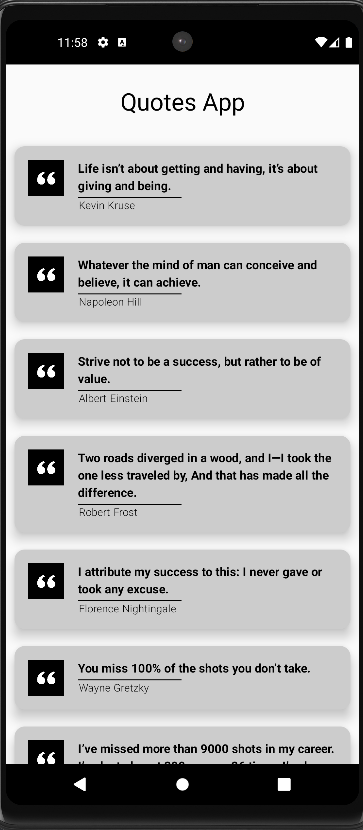
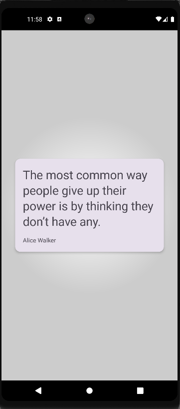

## Quotes

A simple Android application that displays a list of inspirational quotes using Jetpack Compose. Users can browse through the quotes and see the author of each quote. The app uses a modern UI approach with Material Design 3.

## Features

- Quote List: Displays a list of quotes in a clean and user-friendly interface.
- Detail Navigation: Clicking on a quote opens a detailed view with more information about the quote and its author.
- Material Design 3: The app follows the latest Material Design guidelines, providing a consistent and visually appealing UI.


## Screenshots





## Tech Stack

**Kotlin:** For app development.

**Jetpack Compose:** For building the UI in a declarative way.

**Material Design 3:** To provide a modern and consistent UI.

**Android Studio:** Used as the main IDE for development.
## Installation

**1. Clone the repository:**

```bash
git clone https://github.com/yourusername/quotes-app.git

```
**2. Open the project in Android Studio:**

    Click on File > Open.

    Select the project folder.

**3. Sync the project with Gradle files.**

**4. Build and run the app on an emulator or a physical device.**

## Usage

    Launch the app.

    Browse through the list of quotes.

    Tap on a quote to view more details about the quote and its author.

